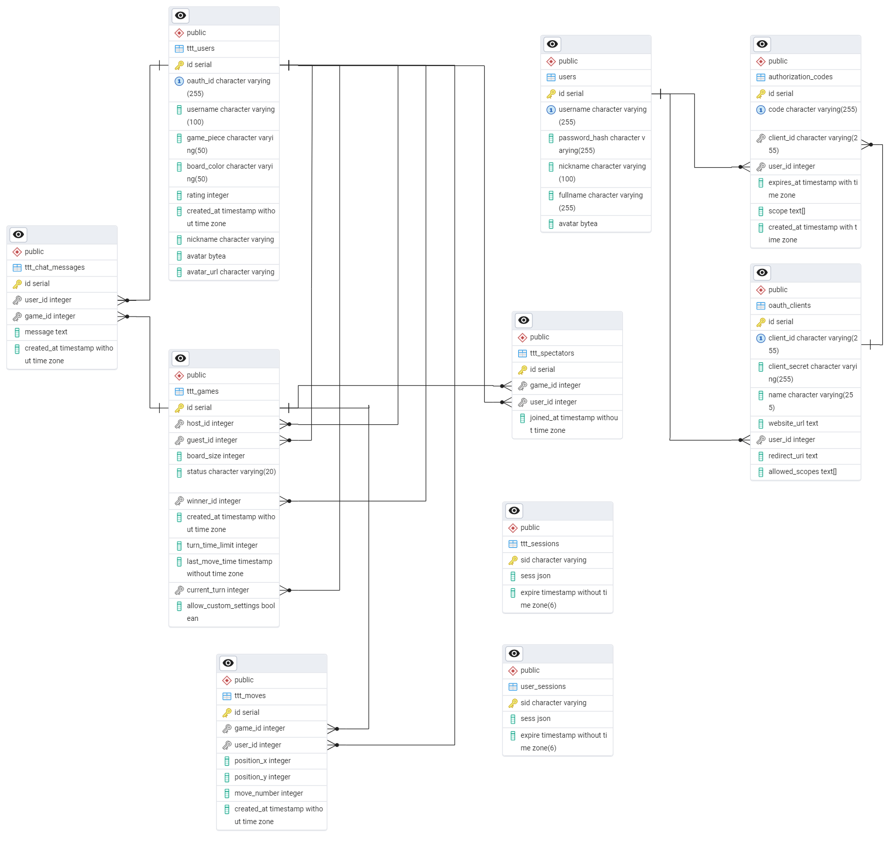

# OAuth Real-Time Tic-Tac-Toe

This is a real-time Tic Tac Toe game with custom OAuth 2.0 authentication developed from scratch.

## Features

### Authentication

-   Secure `OAuth 2.0` authentication system
-   Custom-built authentication server
-   Multiple scope support (`profile:base` and `profile:full`)
-   HTTPS/SSL encrypted communication

### Gameplay

-   Multiple board sizes (3x3, 5x5)
-   Real-time turn-based gameplay
-   Turn timer system
-   Spectator mode for ongoing games
-   Move validation and win detection
-   Game state persistence

### Social Features

-   In-game chat for players and spectators
-   Real-time online user tracking
-   Game invitation system
-   Host approval system for game joins

### Customization

-   Customizable game pieces
-   Board color selection
-   Profile avatar system
    -   Static avatar selection
    -   OAuth server avatar integration

### Competition & History

-   Leaderboard tracking
-   Comprehensive match history
-   Game replay system
    -   Manual move-by-move replay
    -   Automatic replay with speed control

## Tech Stack

-   **Backend**: Node.js, Express.js, Passport.js, Socket.IO
-   **Frontend**: Bootstrap, jQuery, Handlebars.js
-   **Database**: PostgreSQL (with pg-promise)

## Database Schema

The application uses PostgreSQL with the following schema design:



### Key Relationships:

-   Users can host or participate in multiple games
-   Each game has exactly one host and optionally one guest
-   Moves are linked to both the game and the user who made them
-   Chat messages are associated with both users and optionally with specific games
-   Sessions are managed separately for user authentication

## Getting Started

### Prerequisites

-   Node.js
-   PostgreSQL
-   OpenSSL for SSL certificate generation

### SSL Configuration

1. Generate a self-signed SSL certificate using OpenSSL:

```bash
# Generate a private key
openssl genrsa -out key.pem 2048

# Create a Certificate Signing Request (CSR)
openssl req -new -key key.pem -out csr.pem

# Generate the self-signed certificate valid for 1 year
openssl x509 -req -days 365 -in csr.pem -signkey key.pem -out cert.pem

```

2. Place the generated files in the `oauth-server/config/ssl` directory.

### Installation

#### Clone the Repository:

```bash
git clone https://github.com/Tondeptrai23/oauth-realtime-tictactoe.git
cd oauth-realtime-tictactoe
npm install
```

#### Database Setup:

-   Create a PostgreSQL database.
-   Execute the `create-table.sql` script provided in the repository to set up the schema.

#### Environment Variables:

-   Copy `.env.sample` to `.env`.
-   Update the first and second sections of `.env` with your database and server configurations.

#### Run the OAuth Server:

```bash
npm run oauth
```

-   Navigate to `https://localhost:3001` to register an account and set up credentials.
-   Fill the remaining sections of the `.env` file with the newly created credentials.

#### Run the Tic Tac Toe Server:

```bash
npm run tic-tac-toe
```

#### Combined Start:

After initial setup, you can start both servers with a single command:

```bash
npm start
```
